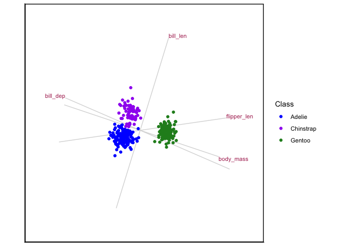
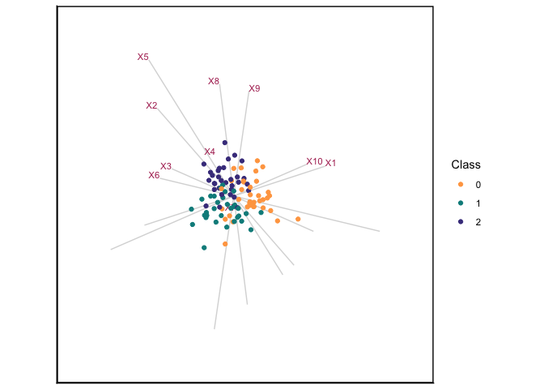

<!-- README.md is generated from README.Rmd. Please edit that file -->

# wideRhino 

The goal of `wideRhino` is to enable the construction of canonical
variate analysis (CVA) biplots for high-dimensional data settings,
specifically where the number of variables ($p$) exceeds the number of
observations ($n$). The package addresses the singularity limitation of
the within-group scatter matrix by leveraging the generalised singular
value decomposition (GSVD).

## Installation

You can install the development version of wideRhino from
[GitHub](https://github.com/) with:

``` r
# install.packages("pak")
pak::pak("RaeesaGaney91/wideRhino")
```

## Example

When $p < n$, then the CVA-GSVD biplot will result to the standard CVA
biplot. Here is an example using the `penguins` data:

``` r
library(wideRhino)
Penguins <- datasets::penguins[stats::complete.cases(penguins),]
CVAgsvd(X=Penguins[,3:6],group = Penguins[,1]) |> 
  CVAbiplot(group.col=c("blue","purple","forestgreen"))
#> Warning: The `x` argument of `as_tibble.matrix()` must have unique column names if
#> `.name_repair` is omitted as of tibble 2.0.0.
#> ℹ Using compatibility `.name_repair`.
#> ℹ The deprecated feature was likely used in the wideRhino package.
#>   Please report the issue to the authors.
#> This warning is displayed once every 8 hours.
#> Call `lifecycle::last_lifecycle_warnings()` to see where this warning was
#> generated.
```



When $p > n$, then the standard CVA biplot will not work due to the
singularity of the within-scatter matrix, and this is when the GSVD
becomes useful. Using a simulated data set with 3 groups, 100
observations and 300 variables, a CVA-GSVD biplot can be constructed:

``` r
data(sim_data)
CVAgsvd(X=sim_data[,2:301],group = sim_data[,1]) |>
  CVAbiplot(group.col=c("tan1","darkcyan","darkslateblue"),which.var = 1:10,zoom.out=80)
```



## About the name 🦏

The name `wideRhino` is inspired by the white rhinoceros, a species
distinguished by its wide mouth and short legs. This physical structure
reflects the statistical characteristics of the data the package is
designed for: wide data with a large number of variables ($p$) and a
small number of observations ($n$) — a setting often described as “large
$p$, small $n$”.

Just as the white rhino’s wide frame is well-adapted to its environment,
wideRhino is purpose-built for the challenges of high-dimensional
multivariate analysis. By leveraging the generalised singular value
decomposition (GSVD), it allows users to construct canonical variate
analysis (CVA) biplots even when classical assumptions break down.
